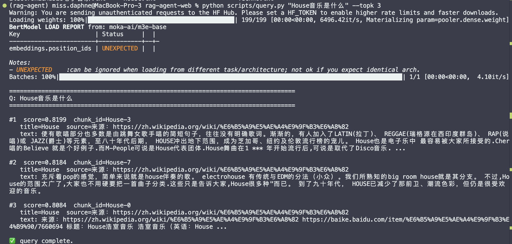
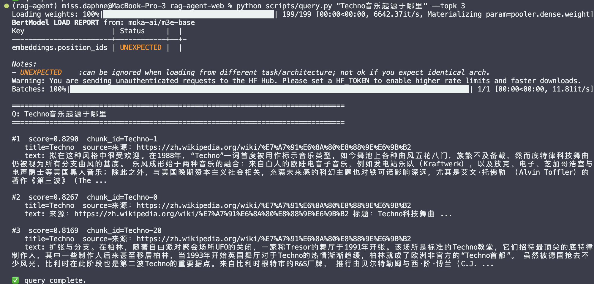
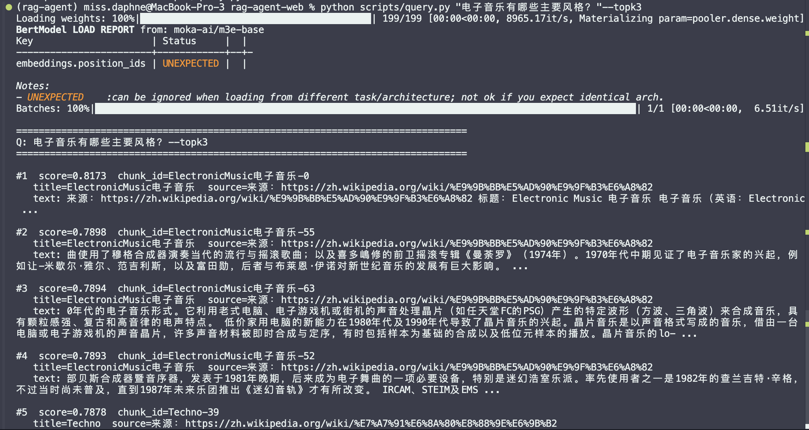

# Week2 测试报告 — 向量知识库与检索系统实现

## 一、数据集说明

### 1. 原始数据来源

本系统构建了一个小型测试使用的电子音乐主题知识库，包含以下三篇文本：

- ElectronicMusic电子音乐.txt
- House.txt
- Techno.txt

数据来源为公开百科类文本资料，内容涵盖电子音乐的发展历史、风格分类及代表流派。

### 2. 数据规模

- 原始文档数量：3篇
- 切分后 chunk 总数：129条
- 存储路径：
  - 原始文本：`data/raw/`
  - 切分结果：`data/processed/chunks.jsonl`

本数据集适用于测试：

- 定义类查询
- 风格分类查询
- 音乐流派对比查询
- 发展历史类查询

---

## 二、文本预处理与切分策略

### 1. 清洗流程

- 去除多余空格与空行
- 标点规范化
- 保留语义完整句子结构

### 2. 分句方式

- 基于中文标点符号（。！？等）进行规则分句

### 3. Chunk策略

- 基于字符长度进行切分
- 每段约 350 字
- 使用句级回退方式实现 overlap（约 2–3句）

设计目的：

- 保证语义完整性
- 减少上下文断裂
- 提高检索召回质量

---

## 三、Embedding 模型说明

- 使用模型：`moka-ai/m3e-base`
- 向量维度：768
- 框架：sentence-transformers
- 向量归一化：已启用（L2 normalization）

### 模型选择理由

m3e-base 是针对中文语义检索优化的通用 embedding 模型，适用于相似度匹配与信息检索任务。

归一化后可使用内积（Inner Product）近似余弦相似度。

---

## 四、向量索引构建（FAISS）

- 索引类型：IndexFlatIP
- 相似度计算方式：内积（≈ 余弦相似度）
- 索引文件：`data/index/faiss.index`
- 向量总数：129

评分规则说明：

- 分数越高 → 语义相似度越高

---

## 五、测试用例设计与结果分析

测试问题使用：python scripts/query.py "问题" --topk 3

---

### 测试1：House音乐是什么？

结果特点：

- Top-1、Top-2、Top-3 均来自 House 文档
- 相似度分数约 0.80~0.82
- 内容准确描述 House 定义与特征

人工评估：相关，但是回答的不够清晰

---

### 测试2：Techno音乐起源于哪里？

结果特点：

- Top结果来自 Techno 文档
- 正确匹配历史起源内容
- 第三条可能为 ElectronicMusic 概述

人工评估：部分相关，但是回答的不够准确，不够有逻辑

---

### 测试3：电子音乐有哪些主要风格？

结果特点：

- Top-1 命中 ElectronicMusic 主文档
- 相似度分数约 0.78~0.81
- Top-2/3 返回 House 与 Techno 相关内容

人工评估：部分相关，但是回答的不够准确

---

## 六、整体效果分析

### 优点

1. 定义类查询召回准确
2. 风格分类问题语义理解较好
3. 流派层级关系（电子音乐 → House / Techno）表现合理
4. 分数分布稳定（约 0.75~0.85）

### 局限

1. 对比类问题无法自动综合分析
2. 小规模数据集限制语义空间
3. 部分 chunk 存在冗余

---

## 七、改进方向

1. 使用 token-based chunk 替代字符长度切分
2. 增加更多电子音乐流派文档
3. 引入 reranking 模型（cross-encoder）
4. 升级为 IVF 或 HNSW 索引结构
5. 下一阶段接入 LLM，实现完整 RAG（检索 + 生成）

---

## 九、结论

本周成功完成：

- 知识库构建
- 中文 embedding 向量化
- FAISS 向量索引
- Top-K 检索系统
- 可复现的一键流程

系统已具备接入生成模型构建完整 RAG 系统的基础。

