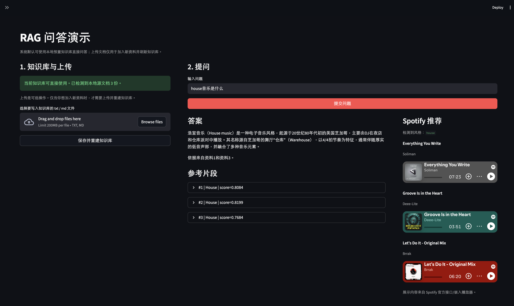

# Week3 测试报告 — 中文电子音乐智能问答系统（RAG + 多轮记忆 + 重排 + Web）

## 一、项目目标

本周目标是在 Week2 向量检索系统基础上，完成可演示的中文电子音乐智能问答网站，实现“检索 + 重排 + 生成 + 多轮对话 + 可视化交互”的完整闭环。

核心要求包括：

- 接入大语言模型，生成最终回答
- 构建统一 RAG 管道（检索、重排、生成）
- 支持多轮对话记忆与追问
- 提升检索结果质量（重排序）
- 完成 Streamlit 网页交互界面

---

## 二、系统实现概览

### 1. LLM 生成模块接入

系统新增了统一生成模块，使用 OpenAI 兼容接口进行回答生成，并通过提示词约束回答“仅基于知识库资料”，避免脱离检索内容自由发挥。

主要能力：

- 读取环境变量配置模型与接口
- 构造上下文提示词并调用 Chat Completions
- 缺少资料时返回“根据当前资料无法确定”

### 2. 统一 RAG 管道

已完成统一入口函数：`answer_question(query, chat_history=None, ...)`

标准流程为：

`问题输入 -> 检索候选 -> 重排 -> 选择 Top-K -> 生成答案 -> 更新记忆`

并返回结构化结果，包含：

- 最终答案
- 检索候选文档
- 重排后文档
- 实际使用文档
- 检索改写信息（是否重写 query）

### 3. 多轮记忆与追问改写

系统新增短期记忆管理模块，保留最近 3-5 轮对话。  
对“它 / 这种音乐 / 该风格”等指代问题，会先结合历史做 query rewrite，再进入检索。

示例：

- 上一轮：`House音乐是什么？`
- 追问：`它起源于哪里？`
- 检索改写后：`House音乐起源于哪里？`

这样显著降低了追问时的检索漂移问题。

### 4. 检索重排序模块（独立实现）

已将重排逻辑独立为 `src/reranker.py`，并在主流程中固定放在“初检索后、生成前”。

策略特点：

- 定义类问题优先定义型 chunk
- 列举类问题优先列表型 chunk，并增强标题多样性
- 先取较大候选池，再裁剪为最终 Top-K

系统还提供了前后对比脚本，可直接查看“重排前 Top-K / 重排后 Top-K”的顺序变化。

### 5. Streamlit 交互界面

已完成 Web 演示页面，支持：

- 文档上传（txt/md）
- 一键重建知识库（preprocess -> embed -> build index）
- 问题输入与提交
- 最终答案展示
- 参考片段展示
- 多轮历史展示（session_state）

并优化为：

- 默认可使用本地预置知识库直接提问（无需先上传）
- 上传功能用于扩充资料并刷新知识库

---

## 三、测试与效果

### 1. 功能验证

本周完成了以下功能联调：

1. 命令行单轮问答（检索增强生成）
2. 多轮追问与指代解析
3. 重排前后结果对比
4. Web 端上传文档与在线问答
5. Web 端参考片段与会话历史展示

### 2. 最终效果截图

最终页面已实现“问答区 + 参考片段 + Spotify 风格推荐联动”展示：

---

## 四、问题与处理

### 1. LLM 环境变量缺失

问题：Web 端调用时报 `Missing LLM_API_KEY`  
处理：在启动 Streamlit 的同一终端中设置环境变量并重启应用。

### 2. 多轮追问检索偏移

问题：早期实现仅在生成阶段利用记忆，检索阶段仍用模糊 query  
处理：加入历史驱动的 query rewrite，再执行检索。

---

## 五、结论

本周已完成从“检索系统”到“可演示的中文电子音乐 AI 问答网站”的关键升级。  
系统具备完整 RAG 主流程、可解释依据、多轮追问能力、重排优化能力以及 Web 交互能力。
