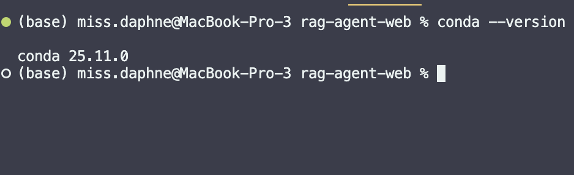
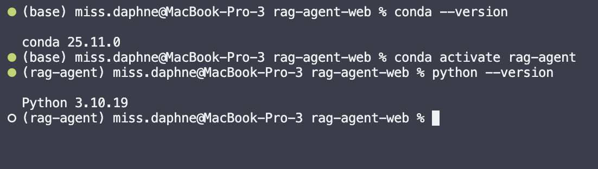
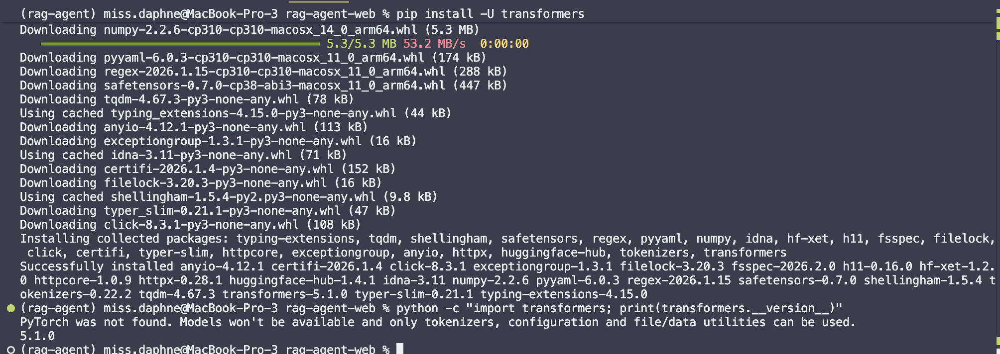
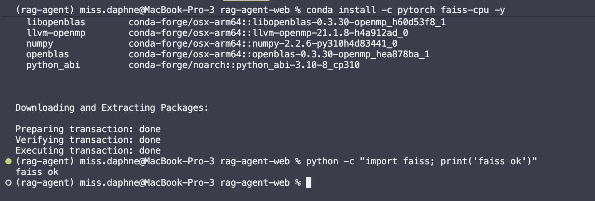
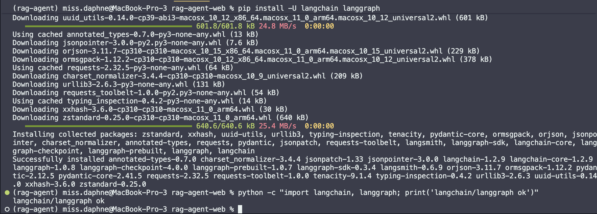
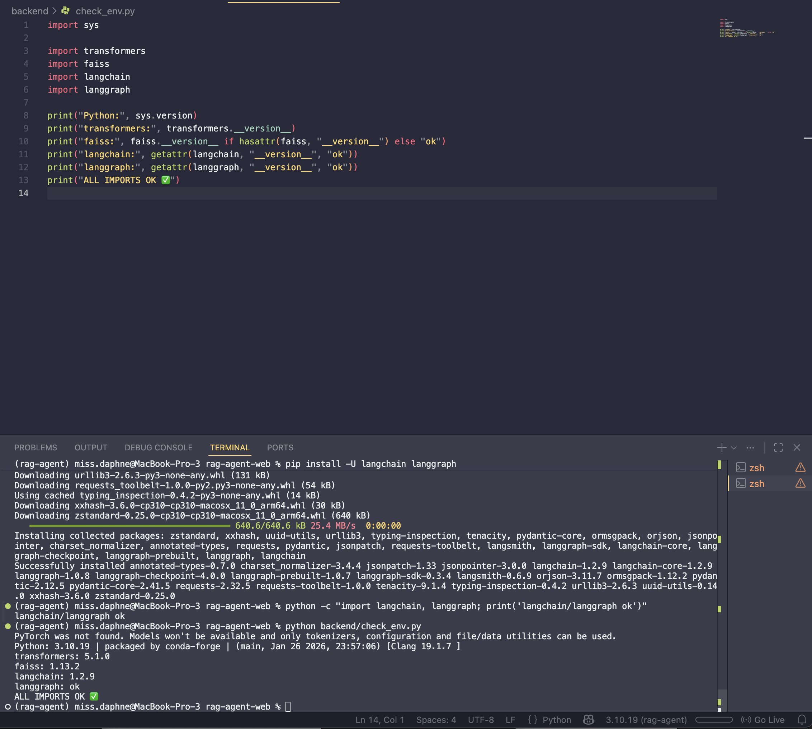

# Week 1 Report

## 核心概念理解

### Rag

Rag（Retrieval-Augmented Generation）是一个流程架构（workflow / pipeline）
用户问题 -> 问题 embedding -> 向量检索（知识库) -> 相关 chunks（外部知识) -> LLM（生成回答）

在 RAG 架构中，知识库并不是被动的数据存储，而是一个可被语义查询、动态调用、并与大模型生成过程实时耦合的外部记忆系统。

### 知识库（Knowledge Base）
知识库（Knowledge Base）是在 RAG 系统中，用于存储经过结构化处理的外部知识内容，并支持被检索模块高效查询的持久化信息集合。

它是一个被设计好、可被系统调用的知识存储层。

在 RAG 架构中，知识库充当系统的外部知识源，通过向量检索机制在生成阶段被动态调用，从而弥补大模型参数记忆有限和知识过时的问题。

知识库在 RAG 里到底存了什么？通常包含三类东西：

1. 原始或切分后的文本内容
	* 文档 chunk（最小语义单元）
	* 每个 chunk 对应一段原文
2. 向量表示（Embeddings）
	* 每个 chunk 对应一个向量
	* 用于语义检索
3. 元数据（Metadata）
	* 文档来源
	* 时间戳
	* 作者 / 标签
	* chunk 在原文中的位置

元数据非常重要，它决定你后面能不能做过滤、排序、解释来源。

构建知识库”的流程
原始文档
 → 清洗
 → 切块
 → Embedding
 → 存入知识库（文本 + 向量 + metadata）

### Embedding
Embedding 是把“语言”翻译成“可计算语义”的桥梁。

在基于 Agent 的系统中，embedding 不仅用于外部知识库的向量化，还可作为 Agent 内部记忆表示的基础形式，使系统能够基于语义相似性进行回忆、关联和决策。

1. 构建知识库（离线）
	* 文档 → 切块 → embedding → 向量索引
1. 理解用户问题（在线）
	* 用户问题 → embedding → 相似度搜索

**Word2Vec**

**“You shall know a word by the company it keeps.”一个词的意义由它经常一起出现的词决定**

工作原理：

Word2Vec用一个浅层神经网络，从大量文本中学习词向量，主要有两种结构：

*  CBOW（Continuous Bag of Words）
	* 用上下文词预测中心词

* Skip-gram
	* 用中心词预测上下文词

训练完成后：

* 每个词 → 一个固定向量
语义相近的词 → 向量距离近

优点：简单、高效、首次证明“向量能表示语义”

缺点：
一个词只有一个向量
无法处理一词多义（bank of river vs bank of money）

**GloVe**

 **词的意义来自于全局共现统计信息。**
工作原理：

* 构建一个 词-词共现矩阵
* 统计词在整个语料中一起出现的频率
* 通过矩阵分解 + 优化目标学习词向量

**BERT**

**同一个词，在不同上下文中，向量是不同的。**
工作原理：

BERT 是基于 Transformer 的预训练语言模型，使用：

* Masked Language Modeling（MLM）随机遮住词，让模型预测

* Next Sentence Prediction（NSP）学习句子级关系（原版 BERT）

训练后：

* 不再是“词 → 向量”

* 而是“词在某个句子里的表示 → 向量”

举个非常关键的例子:“bank” 在river bank和investment bank中，会生成完全不同的 embedding

* Word2Vec / GloVe 学的是“词本身的语义”，BERT 学的是“词在语境中的语义”。

* Word2Vec 和 GloVe 奠定了词向量的基础，而 BERT 通过引入上下文建模，使 embedding 从静态表示演进为动态语义表示，为现代 RAG 和语义检索系统提供了关键技术支撑。

### 向量检索（Vector Retrieval）
向量检索（Vector Retrieval）是指在向量空间中，通过计算向量之间的相似度，从大量向量中高效地找到与查询向量语义最相近的数据项的过程。

### 记忆（memory）
记忆（memory）是在智能体系统中，用于存储、更新和调用历史信息的机制，使系统能够在多轮交互和长期任务中保持上下文连续性和行为一致性。
记忆是一种“状态（state）管理机制。

在 Agent 系统里，常见三类内容：

1. **对话历史（Conversation History）：**用户说过什么，Agent 回答了什么，当前话题是什么
2. **用户相关信息（User State）：**偏好（语言、风格），已确认的事实，长期设置

3. **任务状态（Task State）：**当前进行到哪一步，已完成 / 未完成的子任务，中间结论

记忆在系统中的常见分类：

1. **短期记忆（Short-term Memory）：**当前对话上下文，通常直接放进 prompt，受上下文窗口限制
2. **长期记忆（Long-term Memory）：**跨会话存在，通常存储在外部系统，可用向量检索 / KV / 数据库

### LLM（Large Language Model）
LLM（Large Language Model，大语言模型）是一类基于大规模神经网络训练的生成式模型，能够理解和生成自然语言，并在给定上下文的条件下进行推理、总结和文本生成。

可以把 LLM 想成一个“语言概率引擎”

它做的事情本质上是：根据上下文，预测「下一个最合理的 token 是什么」

在 RAG 中：

* RAG 负责“找依据”
* LLM 负责“把依据说清楚”

在 RAG 架构中，LLM 主要负责基于检索到的上下文进行语言生成，而非直接依赖其参数化记忆回答问题。

LLM 在 Agent 系统中的位置：
在 Agent 架构里，LLM 不只是“回答问题”，而是

* 判断下一步该做什么
* 决定是否调用 RAG
* 决定是否更新 memory
* 决定是否调用工具

在基于 Agent 的系统中，LLM 更像是一个“决策核心”，而非单纯的文本生成器。

### 多轮对话（Multi-turn Conversation）
多轮对话（Multi-turn Conversation）是指系统在连续的多次用户与系统交互中，能够基于之前的对话内容理解当前输入并生成一致、连贯回应的交互形式。

多轮对话解决的核心问题：

1. **指代消解（Reference Resolution）**
	* 它 / 那个 / 上面说的
	* 当前问题依赖之前内容
2. **上下文累积（Context Accumulation）**
	* 逐步深入同一主题
	* 后续问题建立在前面结论之上
3.  **连续任务执行**
	* 分步骤完成复杂任务
	* 每一步都依赖上一步状态

技术上，常见实现方式：

1.  对话缓冲（Conversation Buffer）
	* 直接把历史对话放进 prompt
	* 简单但受上下文窗口限制
2.  对话摘要（Conversation Summary）
	* 用 LLM 压缩历史
	* 保留关键信息
	* 节省上下文长度
3.  向量化对话记忆
	* 将历史对话 embedding
	* 按需检索相关内容
	* 适合长期、多主题对话

### 总结
* **LLM：**负责理解和生成语言
* **RAG：**负责给 LLM 提供事实依据
* **知识库：**负责存储外部知识
* **Embedding：**把语言变成向量
* **向量检索：**找到相关内容
* **Memory：**保持状态和连续性
* **LangGraph：**控制整个流程

## 开发环境搭建

### Conda 环境创建

### transformers 安装验证

### faiss 安装验证

### langchain/langgraph 安装验证

### check_env.py 验证结果

